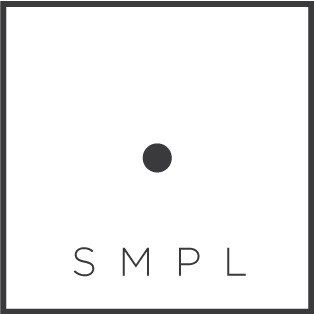

smpl
====
simplified modelling programming language
---

smpl (pronounced "simple") is a compiler which allows you to write your code the way you want. You define simple idioms that make sense to you, and use them to construct your code, then compile it down to your language of choice.

It's not just a simple compiler, because smpl makes no judgements of which language you will be targeting for your compile.  Compile it to C, Ruby, PHP, whatever, its up to you.

> smpl as that!

## Get Started
simply install the package globally to get the command line tool
    npm install smpl -g
    smpl --help

## Syntax
smpl has a very small set of helper macros which you can use to construct your patterns.
#### pattern ( input... ) => { output... }
Using the pattern macro,  you place the pattern you wish you match in parenthesis, and place how you want it to transform in the backets.

    pattern ( hello world ) => { console.log("hello world") }
    hello world
    //compiles to console.log("hello world")
#### pattern name (input) => { output }
Sometimes you want to use a pattern in another pattern. To do this you must name your pattern and use the expression variable `$name` denoted by a "$" symbol  followed by a color `:` and the name of your pattern. you can then use that value caught by your variable in your output

    pattern name ( world ) => { world } //naive demonstration. simply being used  to demonstrate the point
    pattern ( hello $name:name  ) => { console.log("hello $name") }
    hello world
    //outputs console.log("hello world");

there are a number of built in types which you can use out the gate.
+ `lit`: matches a single literal identifier. ex. `hello` `world` `susan` `new` `var`
+ `num`: matches a number. ex. `1` ` 2` `30` `540`
+ `str`: matches a string. ex. `"hello world"` `'hello world'`
+ `op`: matches an operator. ex `+` `-` `==` `=` `*`
+ `punc`: matches a punctuator. ex `.` `;` `:` `,` `!`
+ `comment`:  right now it only matches javascript style comments. (may extend it to `#` style comments in the future) ex. `\\comment` `\* comment *\`
+ `func`: right now only supports javascript style function expressions and declarations. ex `function (){ ... }` `function name (){ }`
+ `afunc`: javascript style arrow functions. ex `(x)=>x` `(x)=>{ return x }`
+ `expr` : matches all of the above plus any patterns you define with a name.

you can use these helpers to help build up dynamic style patterns.

    pattern hello ( hello $name:lit ) => { hello("$name") }
    pattern greeting ( $hello:hello , welcome to my $place:lit ) => { welcome($hello, $place ) }
    hello steven //compiles to hello("steven")
    hello beth, welcome to my home //compiles to welcome(hello("beth"), home)
as you can see, nested patterns compile to their own outputs once they are placed.
#### capture name ( input ) => { output }
Along with named patterns, you can also define places where you dont want to to necessarily transform the data, merely capture something about it. Thats where the captuere macro comes along. Use the above syntax to capture data to be used in a pattern later. For instance, you may want to capture all of the variable names you declare in your document, and use them in specific patterns later.

In fact, lets use that example to construct a new hello world, where the only input it will allow is the names of variables that i've declared.

    capture var ( var $name:lit ) => { $name }
    pattern ( hello $name:var ) => { hello("$name") }

    hello james // compiles to hello james
    var james = true;
    hello james //compiles to hello("james")

## Command Line Tool
Once you have constructed your documents, use the command line tool to compile it into your target language.  you start with prompt `smpl`
#### smpl compile [dir]  [options]
compile is your entry point. you can simply use the `smpl compile` command along with input glob to parse your files.

    $  smpl compile ./example/*.example

optionally you can use `c` or `p`

    $  smpl c ./example/*.example

this will simply compile your file  into a javascript file in the same directory.  You can also optionally specify different options to alter your results.

#### options
##### --extension ||  -e
You can use the extension's flag to change the file type of your outputs

    $   smpl c ./example/*.example  -e .cpp

will output a c++ files from your .example's
##### --output || -o
Specify an output directory

    $   smpl c ./example/*.example -o ./build

##### --module || -m
Sometimes you may want to seperate your patterns from your working documents. If you have done that, you can specify the document with your patterns using the `-m` flag

    $   smpl c ./example/*.example -m patterns.js -o ./build

##### --concat || -c
if you would like your output to be in a single file, use the `-c` flag to join them together.

    $   smpl c ./example/*.example -c example.js -o ./build

#### smpl --help
use the help flag after any argument to get an overview of all of the arguments you can use.

    $    smpl --help

    Invalid Command. Showing Help:

    Commands:

    help [command...]        Provides help for a given command.
    exit                     Exits application.
    compile [options] <dir>  Parses the files at the given directory (node glob)

## Be Aware
This is still in Pre-Alpha stage. I literally built this in a couple days, so i would'nt recommend using it in production just yet. I havent even written any tests for it yet. So, use at your own risk.

That being said, contribute to your hearts desire, I am always open to new ideas and ways in which we can improve this library.  Drop any issues, updates, ideas, etc. in the issues of the git repo and I'll try my best to address it in a timely fashion.
